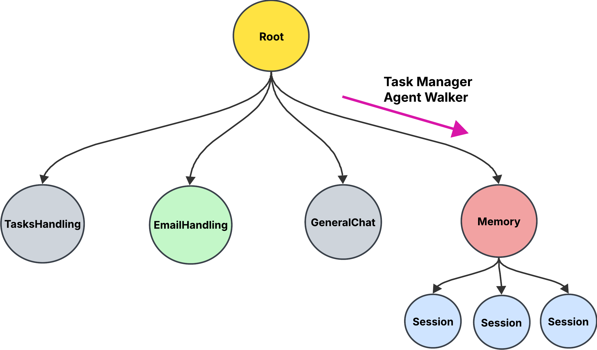

# Build a Task Manager with byLLM - Beginner Tutorial

Welcome! This guide will teach you how to build a Task Manager agent from scratch using the byLLM library. You'll learn the architecture, how to set up your project, and how to write the code step by step.

For 
## 1. Overview & Architecture

The Task Manager is built as a graph of nodes, each responsible for a specific function.



### Main components:
- **TaskHandling**: Manages tasks (add, summarize, extract info)
- **EmailHandling**: Composes and sends emails
- **GeneralChat**: Handles general chat
- **Memory/Session**: Tracks user history and context
- **task_manager walker**: Routes user input to the correct node


## 2. Project Setup

1. **Create a new folder for your project.**
2. **Install dependencies:**
   ```bash
   pip install byllm jac-cloud
   ```
3. **Create your jac files:**
   - Start with a `main.jac` file in your project folder.
4. **Set up environment variables:**
   - Create a `.env` file for email credentials (if using email features).


## 3. How byLLM Uses Tools & ReAct Method

byLLM uses the **ReAct** method to combine reasoning and action. You provide a list of tools (functions) to the LLM, and it decides which tool to use based on the user's input and context.

### How to Provide Tools
- In your node, you define functions (e.g., `add_task`, `summarize_tasks`).
- When you call the LLM, you pass these functions as the `tools` argument:

	```jac
	def route_and_run(utterance: str, history: str) -> str by llm(
			method="ReAct",
			tools=([self.extract_task_info, self.summarize_tasks])
	);
	```
- The LLM will reason about the user's request and select the most appropriate tool to execute.

### How Node & Tool Selection Works
- The `task_manager` walker uses the LLM to decide which node (TaskHandling, EmailHandling, GeneralChat) should handle the request:

	```jac
	def route_to_node(utterance: str, history: str) -> RoutingNodes by llm();
	```
- Once the node is selected, its `route_and_run` method provides a set of tools to the LLM.
- The LLM chooses the tool, executes it, and returns the result.

### Example: Task Creation
1. User says: "Schedule a meeting tomorrow at 3pm"
2. The walker routes to `TaskHandling`.
3. The LLM chooses `extract_task_info` as the tool, extracts details, and calls `add_task`.
4. The agent responds: "Task added successfully."

### Example: Email Sending
1. User says: "Send an email to Bob about the meeting"
2. The walker routes to `EmailHandling`.
3. The LLM drafts the email, asks for confirmation, then calls `send_email` if confirmed.


### 3.1. Task Node
Defines a single task and its properties.

```jac
node Task {
	has task:str = "";
	has date:str = "";
	has time:str = "";
	has status: str = "pending";
}
```

**Explanation:** This node stores the details for each task (title, date, time, status).

### 3.2. Memory & Session Nodes
Track user sessions and history.

```jac
node Memory {}

node Session {
	has history: list = [];
	has created_at: str = get_current_datetime();

	def add_history(entry: str) {
		self.history = self.history + [entry];
	}
	def get_history -> str {
		return "\n".join(self.history[-10:]);
	}
}
```

**Explanation:** Memory holds sessions. Each Session tracks the last 10 interactions for context.

### 3.3. TaskHandling Node
Handles adding, extracting, and summarizing tasks using LLM tools.

```jac
node TaskHandling {
	def add_task(task: Task) -> str {
		self ++> task;
		return "Task added successfully";
	}
	def check_scheduled_tasks -> list[Task] {
		return [self --> (`?Task)];
	}
	def extract_task_info(utterance: str) -> str by llm(
		method="ReAct",
		tools=([self.add_task, get_current_datetime])
	);
	def summarize_tasks() -> str by llm(
		method="ReAct",
		tools=([self.check_scheduled_tasks])
	);
	def route_and_run(utterance: str, history: str) -> str by llm(
		method="ReAct",
		tools=([self.extract_task_info, self.summarize_tasks])
	);
	can execute with task_manager entry {
		session = visitor.session;
		response = self.route_and_run(visitor.utterance, session.get_history());
		session.add_history(
			"user: " + visitor.utterance + "\nai: " + response
		);
		report {
			"session_id": jid(visitor.session),
			"created_at": visitor.session.created_at,
			"response": response
		};
	}
}
```

**Explanation:**
- `add_task`: Adds a new task node.
- `extract_task_info`: Uses LLM to extract task details from user input and add the task.
- `summarize_tasks`: Uses LLM to summarize all tasks.
- `route_and_run`: Uses LLM to decide which tool to run (extract or summarize).

### 3.4. EmailHandling Node
Handles email composition and sending.

```jac
node EmailHandling {
	has sender_email: str = os.getenv("SENDER_EMAIL");
	has sender_password: str = os.getenv("SENDER_PASSWORD");
	has sender_name: str = os.getenv("SENDER_NAME");

	def write_email_content(utterance: str, history: str) -> str by llm();
	def send_email(email_content: str, email_subject: str, email_to: str) {
		msg = MIMEText(email_content);
		msg["Subject"] = email_subject;
		msg["From"] = self.sender_email;
		msg["To"] = email_to;

		try {
			server = smtplib.SMTP("smtp.gmail.com", 587);
			server.starttls();
			server.login(self.sender_email, self.sender_password);
			server.sendmail(self.sender_email, email_to, msg.as_string());
			server.quit();
		}
		except Exception as e {
			print(f"Failed to send email to {email_to} with subject '{email_subject}': {e}");
		}
	}
	def route_and_run(utterance: str, history: str) -> str by llm(
		method="ReAct",
		tools=([self.write_email_content, self.send_email])
	);
	can execute with task_manager entry {
		session = visitor.session;
		response = self.route_and_run(visitor.utterance, session.get_history());
		session.add_history(
			"user: " + visitor.utterance + "\nai: " + response
		);
		report {
			"session_id": jid(visitor.session),
			"created_at": visitor.session.created_at,
			"response": response
		};
	}
}
```

**Explanation:**
- `write_email_content`: Uses LLM to draft email content from user input.
- `send_email`: Sends the email using SMTP after confirmation.
- `route_and_run`: Uses LLM to decide whether to draft or send email.

### 3.5. GeneralChat Node
Handles general chat using LLM.

```jac
node GeneralChat {
	def chat(utterance: str, history: str) -> str by llm();

	can execute with task_manager entry {
		session = visitor.session;
		response = self.chat(visitor.utterance, session.get_history());
		session.add_history(
			"user: " + visitor.utterance + "\nai: " + response
		);
		report {
			"session_id": jid(visitor.session),
			"created_at": visitor.session.created_at,
			"response": response
		};
	}
}
```

**Explanation:** Uses LLM to respond to general chat queries.

### 3.6. Routing with Walker
Routes user input to the correct node using LLM.

```jac
walker task_manager {
	has utterance: str = "";
	has session_id: str = "";
	obj __specs__ {
		static has auth: bool = False;
	}
	def route_to_node(utterance: str, history: str) -> RoutingNodes by llm();
	can execute with `root entry {
		memory_list = [root --> (`?Memory)];
		if not memory_list {
			memory_list = root ++> Memory();
		}
		memory = memory_list[0];
		if not self.session_id {
			session_list = memory ++> Session();
			self.session = session_list[0];
		} else {
			self.session = &(self.session_id);
		}
		routed_node = self.route_to_node(self.utterance, self.session.get_history());
		node_cls = globals().get(routed_node.value, "");
		if not node_cls {
			return;
		}
		node_inst = node_cls();
		visit [-->(`?node_cls)] else {
			attached_routed_node = here ++> node_inst;
			visit attached_routed_node;
		}
	}
}
```

**Explanation:** Uses LLM to decide which node (TaskHandling, EmailHandling, GeneralChat) should handle the user's request, based on the utterance and session history.


## 4. Running & Testing

1. Run your jac file:
   ```bash
   jac serve main.jac
   ```
2. Interact with your agent (add tasks, send emails, chat).

## 4. Running & Testing

### How to Run

Start the project server:
```bash
jac serve main.jac
```

### How to Test

Send a request to the endpoint:
- Endpoint: `walker/task_manager`
- Example payload:
	```json
	{
		"utterance": "add a task to call mom at today 10pm",
		"session_id": ""
	}
	```

You can use tools like curl or Postman:
```bash
curl -X POST http://localhost:8000/walker/task_manager -H "Content-Type: application/json" -d '{"utterance": "add a task to call mom at today 10pm", "session_id": ""}'
```

### Why This is Beautiful

- The entire agent logic is in a single file (`main.jac`), making it easy to read, modify, and share.
- Minimal code and configuration: you can build a powerful agentic app using `byLLM` with just a few lines and less jac files.


## 5. Next Steps & More Learning

- Try adding new features (e.g., reminders, categories)
- Explore more advanced walkers and LLM prompts
- See [main.jac](../v1/main.jac) for a full example

---

**Ready to build? Start coding in your jac file and use this tutorial as your guide!**
