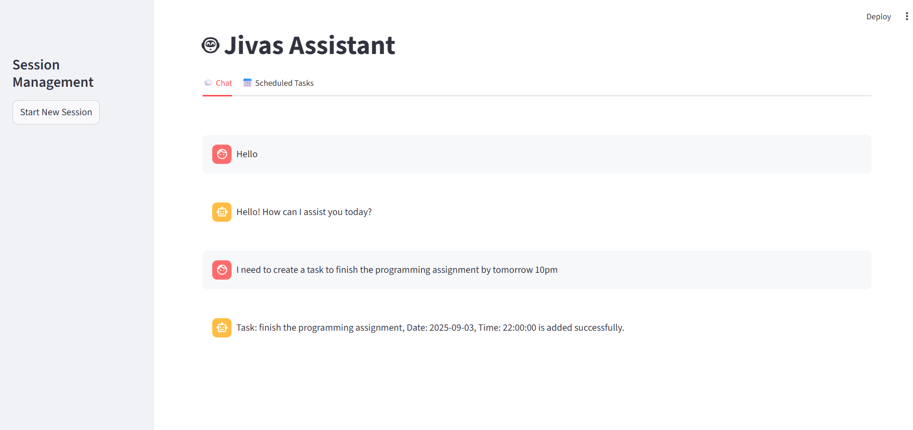
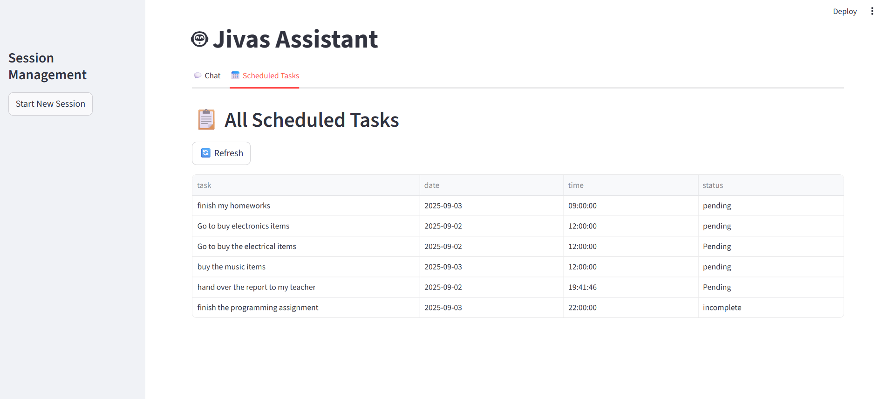

# byllm Frontend

This is the Streamlit-based frontend for the byllm task manager and chat assistant.

## Features
- Chat interface for interacting with the backend agent
- Task list view with date, time, status columns
- Session management (virtual sessions)

## Setup Instructions

1. **Install dependencies**
	```bash
	pip install -r requirements.txt
	```

2. **Run the frontend**
	```bash
	streamlit run app.py
	```

3. **Make sure the backend is running**
	- The frontend expects the backend to be available at `http://localhost:8000`

## Screenshots

### Chat Interface


### Tasks List


---
For more details, see the main project README or contact the maintainers.
